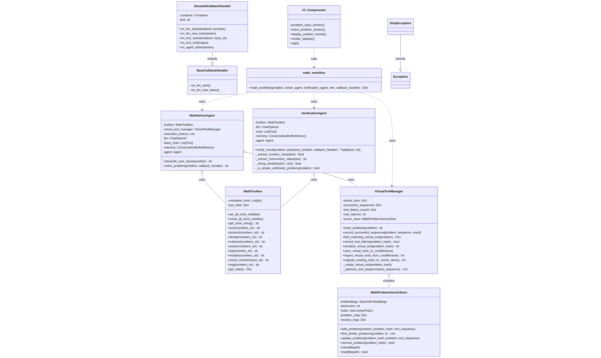
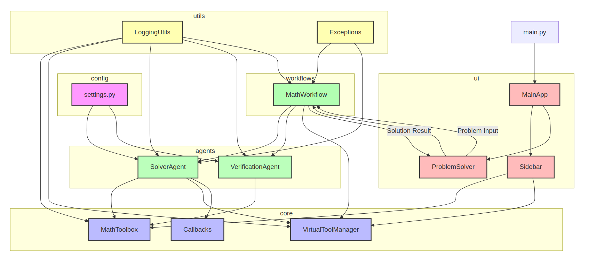

# Math Solver Multi-Agent System

A Streamlit application that uses multiple AI agents to solve and verify math problems.

## Project Structure

- `config/`: Configuration settings
- `core/`: Core functionality (math toolbox, virtual tools)
- `agents/`: Agent implementations
- `utils/`: Utility functions
- `workflows/`: Workflow definitions
- `ui/`: Streamlit UI components
- `tests/`: Unit tests

## Files
```
│
├── config/                    # Configuration files
│   ├── __init__.py
│   └── settings.py            # Contains app settings and API keys
│
├── core/                      # Core functionality
│   ├── __init__.py
│   ├── math_toolbox.py        # Math tools implementation
│   ├── virtual_tool_manager.py # Virtual tool creation and management
│   └── callbacks.py           # Callback handlers
│
├── agents/                    # Agent implementations
│   ├── __init__.py
│   ├── solver_agent.py        # Math solver agent
│   └── verification_agent.py  # Verification agent
│
├── utils/                     # Utility functions
│   ├── __init__.py
│   └── logging_utils.py       # Logging configuration
│
├── workflows/                 # Workflow implementations
│   ├── __init__.py
│   └── math_workflow.py       # Main math solving workflow
│
├── ui/                        # UI components
│   ├── __init__.py
│   ├── main_app.py            # Main Streamlit app
│   ├── sidebar.py             # Sidebar components
│   └── problem_solver.py      # Problem solver UI
│
├── tests/                     # Unit tests
│   ├── __init__.py
│   ├── test_math_toolbox.py
│   └── test_workflow.py
│
├── main.py                    # Application entry point
├── requirements.txt           # Dependencies
└── README.md                  # Project documentation
```

## Features

- Math problem solving with integrated verification
- Virtual tool creation for improved efficiency
- Real-time evaluation of solver performance
- Interactive user interface

## Architecture

This application uses a modular architecture with:

- Multiple specialized agents (solver, verification)
- Virtual tool creation from successful problem-solving sequences
- Integrated validation and retry workflow

## Running

1. Clone the repository
2. Setup a virtual environment `python3 -m venv venv` then `source venv/bin/activate`
   1. remember to run `source venv/bin/activate` every time you open a shell to this project to run
   2. ☝️ Yes, you must activate your environment to grab locally installed libs
3. Install dependencies: `pip install -r requirements.txt`
4. Set your OPENAI_API_KEY or edit main.py 's override_key with your key  
   4. ☝️☝Add your key
5. Run `streamlit run main.py`

## Running unit tests

To run unit tests, run the following:
- `pytest ./agents/test*py ./core/test*py`


# Diagrams

## Sequence


## Class



## Mermaid

